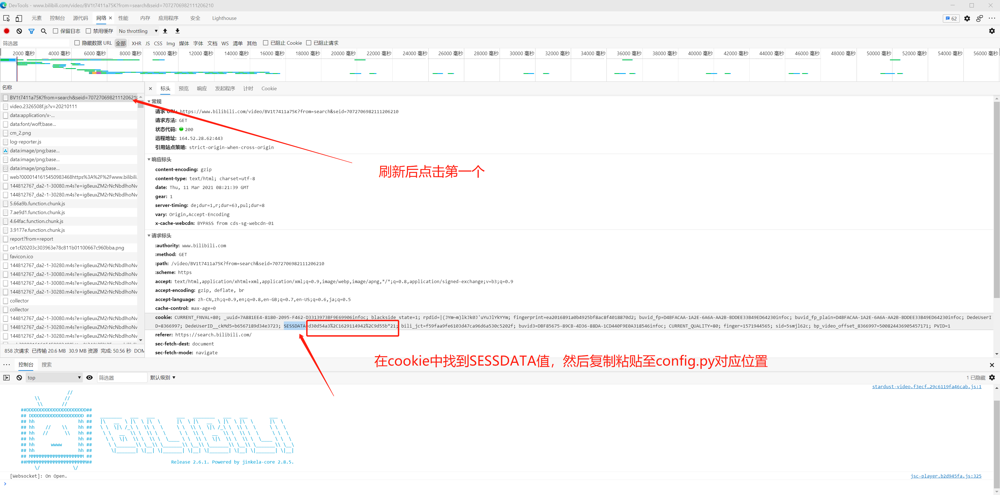

# Bilibili视频下载

<div align="center">
    
</div>

<div align=center>
    
    
    
    
    
</div>

## :pushpin: 功能说明

- [x] B站视频下载
- [x] 支持使用账号 cookie 下载大会员视频
- [x] 异步并发下载
- [x] 批量下载
- [x] 支持分P视频
- [x] 支持充电专属视频下载
- [x] 支持音视频分离下载
- [x] 下载进度条
- [x] 下载摘要统计
- [x] 自动清理临时文件
- [ ] 支持番剧、纪录片下载【待测试】
- [ ] 添加代理【待更新】

## :white_check_mark: 安装依赖库

```bash
pip3 install -r requirements.txt
```

## :pencil2: COOKIE设置说明

打开`config.py`，**需要定期(30天)替换** cookie

替换方法：

1. 浏览器登录 B 站，打开要下载的视频页
2. `Ctrl + Shift + I` 或者鼠标右键选择检查，然后选择`网络`
3. `Ctrl + R` 刷新网页，选择第一个，请求表头中找到 `cookie`



## :pencil2: 下载链接添加说明

打开`config.py`，在 `URL` 列表种添加视频 URL

```py
# 下载视频的 URL
URL = [
    # # 普通视频
    # 'https://www.bilibili.com/video/BV1M4411c7P4/?vd_source=9c3224b88b8a3c4cc210fc6ff9b28f63',
    # 'https://www.bilibili.com/video/BV1hB4y147j8/?spm_id_from=333.337.search-card.all.click&vd_source=9c3224b88b8a3c4cc210fc6ff9b28f63',

    # # 分P视频（第1个分P）
    # 'https://www.bilibili.com/video/BV1TnsZzHEcz/?vd_source=9c3224b88b8a3c4cc210fc6ff9b28f63&spm_id_from=333.788.videopod.episodes',

    # # 分P视频（第2个分P）
    # 'https://www.bilibili.com/video/BV1TnsZzHEcz/?p=2&vd_source=9c3224b88b8a3c4cc210fc6ff9b28f63',

    # 充电专属视频
    'https://www.bilibili.com/video/BV1W1wKeWEVe/?spm_id_from=333.1387.upload.video_card.click&vd_source=9c3224b88b8a3c4cc210fc6ff9b28f63',
]
```

## :pencil2: 保存模式说明

打开 `config.py`，修改 `SAVE_MODE`：

- `"merge"`：合并音视频后保存为 `.mp4`（默认）
- `"separate"`：音视频分开保存（`.mp4` + `.mp3`）
- `"audio_only"`：仅保存音频（`.mp3`）
- `"video_only"`：仅保存视频（`.mp4`）

## :rocket: 运行方法

`python main.py`

```bash
# python main.py
python main.py

============================================================
📹 【13小时完结】国民女神带着可爱女儿找上门求我负责？！可我明明却是个万能单身狗。
📺 清晰度：高清 1080P
============================================================

📥 开始下载视频和音频：【13小时完结】国民女神带着可爱女儿找上门求我负责？！可我明明却是个万能单身狗。_P1.mp4

  音频: 100%|████████████████████████████████████████████████████████████████████████████████████████████████████████████████████████████████████████████████████████████████████████████████████████████████████████████████████████████████████████████████████████████████████████████████████| 726M/726M [04:49<00:00, 2.51MB/s]
  视频: 100%|███████████████████████████████████████████████████████████████████████████████████████████████████████████████████████████████████████████████████████████████████████████████████████████████████████████████████████████████████████████████████████████████████████████████████| 1.43G/1.43G [33:48<00:00, 707kB/s]

✅ 视频和音频下载完成

🎬 合并视频和音频...
✅ 视频合成完成

🧹 已清理临时文件

============================================================
📊 下载摘要
============================================================
✅ 成功下载 1 个视频
⏱️  总计用时：34分钟17秒

已下载的视频：
  1. 【13小时完结】国民女神带着可爱女儿找上门求我负责？！可我明明却是个万能单身狗。 (高清 1080P)

💾 视频保存位置：/home/user/work/repos/bilibili-downloader/output
============================================================
```

## :tv: 运行效果


